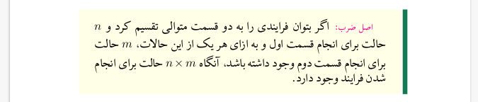

# Discrete Mathematics Book

You can use this template for your own purposes or add content to this book. To use this template, you will have the following commands.

-> `Xelatex 2020` used but `2019` works well too.

<!-- ----------------------------------------------------------------------- -->

* `p`

It provides paragraphs indentations.

```latex
\p
این یک پاراگراف جدید است.
```

<!-- ----------------------------------------------------------------------- -->

* `CHAPTER`

```latex
\CHAPTER[./images/combinations.jpg]{آنالیز ترکیبی}{
    \p
    آنچه در این فصل مورد بحث قرار خواهد گرفت،
    مبحث شمارش است که به محاسبه‌ی تعداد حالات رخداد یک پدیده،
    بدون بررسی تک تک حالات می‌پردازد.
    از کاربردهای این فصل می‌توان به
    محاسبه‌ی احتمالات پیش‌آمد‌ها،
    تخمین زمان اجرا و منابع مصرفی برنامه‌ها،
    برخی از تحلیل‌ها در گراف
    و ...
    اشاره کرد.
}
```


<!-- ----------------------------------------------------------------------- -->

* `SECTION`

```latex
\SECTION{اصول اولیه شمارش}
```


<!-- ----------------------------------------------------------------------- -->

* `SUBSECTION`

```latex
\SUBSECTION{اصل ضرب}
```


<!-- ----------------------------------------------------------------------- -->

* `definition`

```latex
\begin{definition}
    \p
    \focused{اصل ضرب:}
    اگر بتوان فرایندی را به دو قسمت متوالی تقسیم کرد و
    $n$
    حالت برای انجام قسمت اول و به ازای هر یک از این حالات،
    $m$
    حالت برای انجام قسمت دوم وجود داشته باشد،
    آنگاه
    $n \times m$
    حالت برای انجام شدن فرایند وجود دارد.
\end{definition}
```



<!-- ----------------------------------------------------------------------- -->

* `focused`

```latex
\begin{definition}
    \p
    به هر روش قرار گرفتن چند شیء در کنار یک‌دیگر یک 
    \focused{جایگشت}
    از این اشیاء گفته می‌شود.
\end{definition}
```


<!-- ----------------------------------------------------------------------- -->

* `NOTE`

```latex
\NOTE{به الزام استقلال حالات انجام کار از مسیر‌های متفاوت توجه کنید. اگر مسیر‌های متفاوت دارای حالات انجام
مشترک باشند، دیگر مجاز به استفاده از اصل جمع نبوده و باید از اصل شمول و عدم شمول استفاده کنیم.}
```


<!-- ----------------------------------------------------------------------- -->

* `theorem`

```latex
\begin{theorem}
    \p
    \focused{تعمیم اصل جمع:}
    اگر بتوان فرایندی را از 
    $k$
    مسیر متمایز انجام داد که مسیر 
    $i$ام،
    $n_i$
    حالت برای انجام شدن داشته باشد و بین حالات مسیر‌های متفاوت، حالت مشترکی وجود نداشته باشد،
    آنگاه
    $\sum\limits_{i=1}^n n_i$
    حالت برای انجام شدن فرایند وجود دارد.
\end{theorem}
```

or

```latex
\begin{fact}
    ...
\end{fact}
```


<!-- ----------------------------------------------------------------------- -->

* `problem` and `solution`

```latex
\begin{problem}
    \p
    چهار شهر $A, B, C, D$ را متصور شوید که از $A$ به $B$ چهار مسیر، از $B$ به $C$ دو مسیر و از $C$ به $D$
    سه مسیر وجود دارد. چند مسیر متفاوت برای سفر از $A$ به $D$ وجود دارد؟

    \centerimage{.5}{pic.png}

    \solution{
        \p
        سفر از $A$ به $D$ را به سه بخش سفر از $A$ به $B$، از $B$ به $C$ و از $C$ به $D$
        تقسیم می‌کنیم و طبق اصل ضرب، می‌توان نوشت ($N(x,y)$ را تعداد مسیر‌های سفر از $x$ به $y$ درنظر بگیرید):
        $$N(A,D) = N(A,B) \times N(B,C) \times N(C,D)$$
        $$= 4 \times 2 \times 3 = 24$$
    }
\end{problem}
```


Also you can get a name to the problem :

```latex
\begin{problem}[حالات مختلف توزیع اشیا]
    ...
\end{problem}
```

You can change the label of solution like this:
```latex
\solution[new label]{
    ...
}

```


<!-- ----------------------------------------------------------------------- -->

* `Eproblem`

```latex
\Eproblem
\p
سه مهره رخ متمایز و صفحه شطرنجی $8\times8$ داریم. به چند روش می‌توان این سه مهره را در سه خانه از این صفحه قرار داد به طوری که حداقل یک مهره وجود داشته باشد که توسط هیچ مهره‌ای تهدید نمی‌شود؟

```


<!-- ----------------------------------------------------------------------- -->

* `Esolution`

```latex
\Esolution{
    \p
    طبق جدول
    Functions Generating Useful
    از کتاب Rosen
    که استاد نیز به آن اشاره کردند داریم:
    $$(1 - x) ^ {-n} = \sum_{k = 0}^{\infty} \binom{n + k - 1}{k} x^{k} $$
    بنابراین در این سوال داریم:
    $$(1 - 4x) ^ {-5} =
    \sum_{k = 0}^{\infty} \binom{5 + k - 1}{k} (4x)^k $$
    جمله $x^{12}$ به ازای مقدار $k = 12$ ساخته می‌شود. بنابراین جواب برابر خواهد بود با: 
    $$\binom{16}{12} (4)^{12}$$
}

```

You can change the label of solution like this:
```latex
\Esolution[new label]{
    ...
}

```


<!-- ----------------------------------------------------------------------- -->

* `Ewrongsolution`

```latex
\Ewrongsolution{
    \p
    طبق بسط دوجمله‌ای داریم:    
        \begin{align*}
        \frac{1}{(1-4x)^5}=\sum\limits_{k=0}^{\infty} \binom{k+4}{k}  4 ^ k  x^ k              
        \end{align*}
        
        جمله ۱۲ ام دنباله 
        $ a_n$
    ضریب 
    $ x ^ {12} $
    است.

    \begin{align*}
    \longrightarrow a_{12} = \binom{16}{12} 4 ^ {12}
    \end{align*}
}

```

You can change the label of solution like this:
```latex
\Ewrongsolution[new label]{
    ...
}

```


<!-- ----------------------------------------------------------------------- -->

* `exercise`

```latex
\exercise
اتحاد پاسکال را اثبات کنید.

\exercise
رابطه واندرموند را اثبات کنید.
```


<!-- ----------------------------------------------------------------------- -->

* `extra`

```latex
\begin{extra}{تاریخچه پیدایش اصل شمول و عدم شمول}
    \p
    اصل شمول و عدم شمول از یه جایی شروع شد که ...
\end{extra}
```


Also you can change the top left picture just like this:

```latex
\begin{extra}[somewhere/newpic.png]{تاریخچه پیدایش اصل شمول و عدم شمول}
    \p
    اصل شمول و عدم شمول از یه جایی شروع شد که ...
\end{extra}
```

<!-- ----------------------------------------------------------------------- -->

* `englishblock`

Use it to write left to write.

```latex
\englishblock{
    Some Text In English.
}
```
